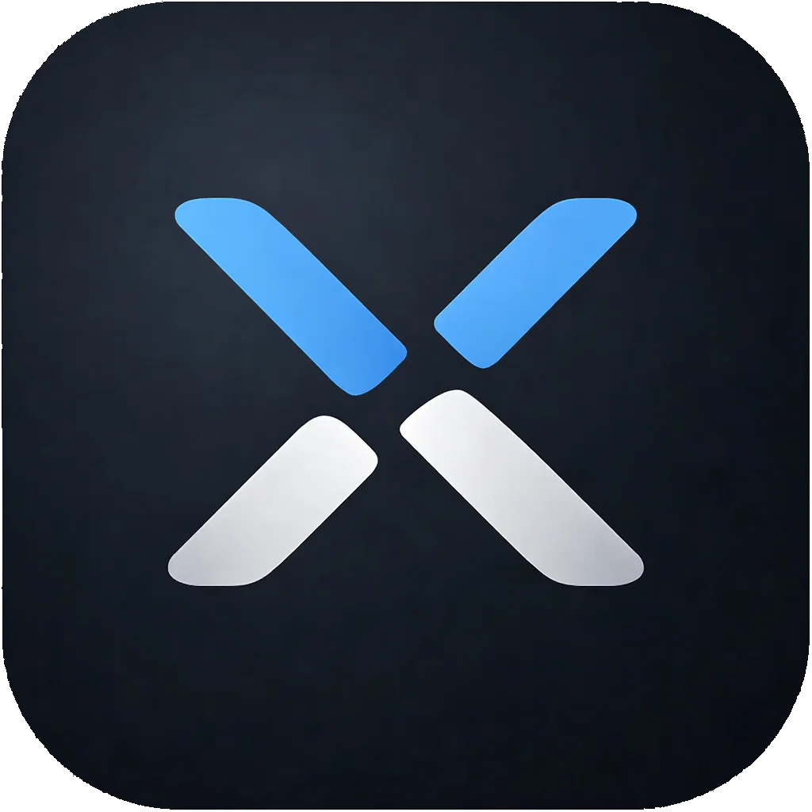
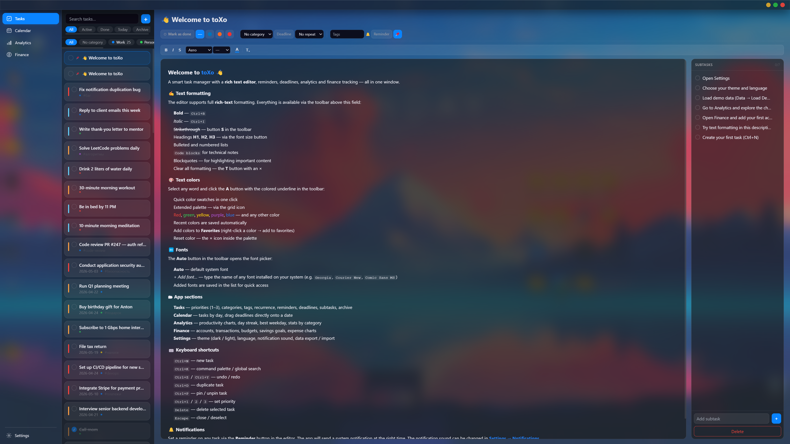
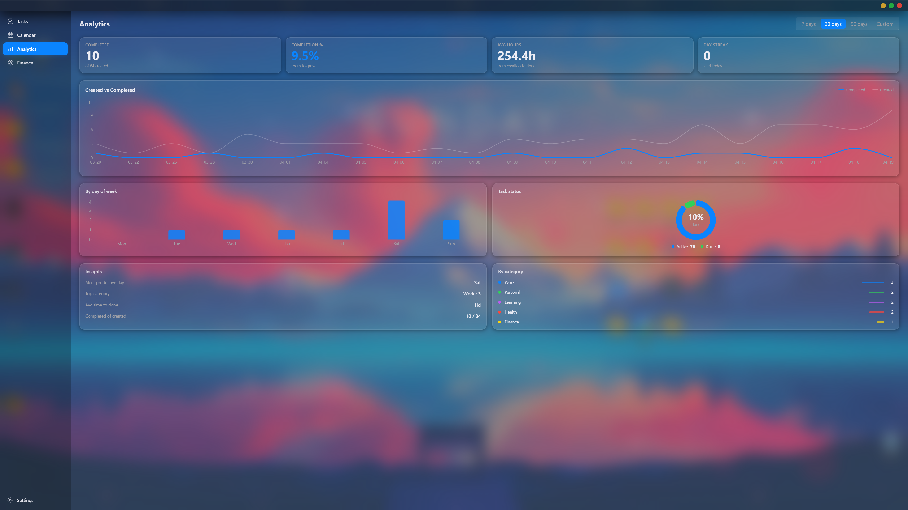
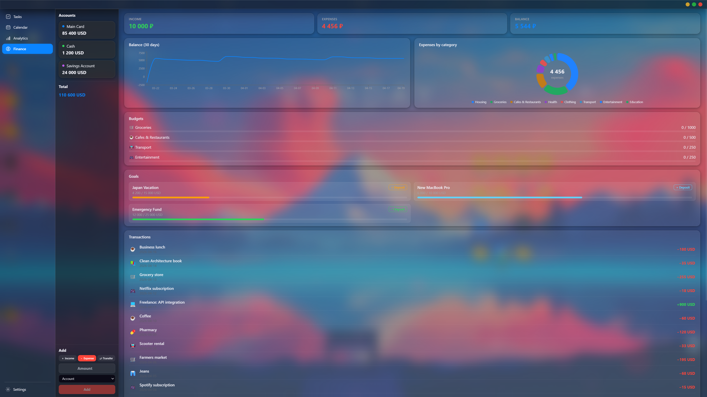
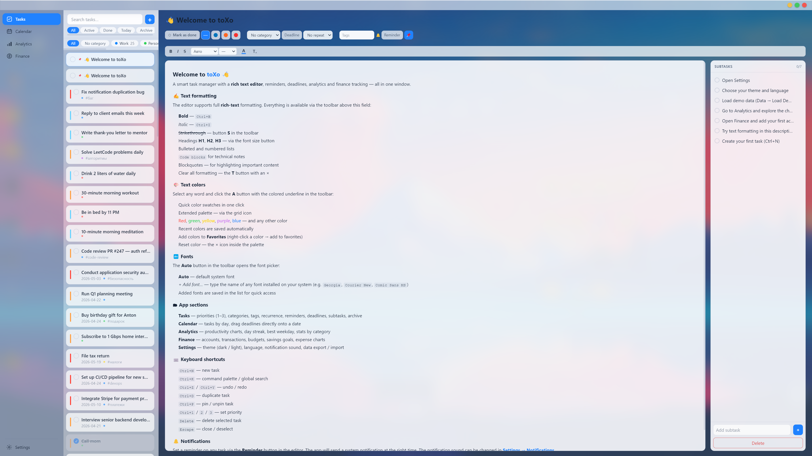
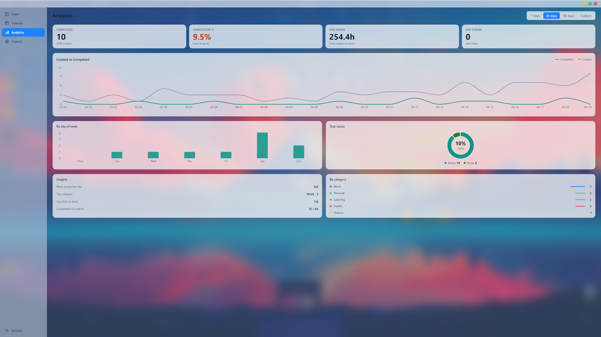

<div align="center">
  

  # toXo

  <p>
    <strong>Task. Finance. Analytics. Calendar.</strong><br/>
    A desktop productivity application built with <strong>Electron + React</strong> — structured, local-first, and designed for focused daily use.
  </p>

  <p>
    
    
    
    
    
    
  </p>

  <p>
    <a href="https://github.com/TheOverforge">
      
    </a>
  </p>
</div>

---

## Overview

**toXo** is a native Windows desktop application built with **Electron 31 + React 18 + TypeScript**.  
It combines a full-featured **task manager**, **personal finance workspace**, **analytics dashboard**, and **calendar** in one polished interface with three switchable themes.

> **One local desktop workspace for planning, tracking, and reviewing your work and personal flow.**

No account. No cloud dependency. No forced sync.  
The database is stored locally in:

```text
%APPDATA%\toxo\tasks.sqlite
```

Compatible with toXo v1.0 (PyQt6) — existing databases open without manual migration.

---

## Why toXo

- **Local-first** — your data stays on your machine
- **Structured UI** — tasks, money, analytics, and planning in one consistent workflow
- **Keyboard-friendly** — command palette, shortcuts, bulk actions, undo/redo
- **Visually polished** — desktop-native feel, theming, DWM acrylic integration
- **Built for real usage** — not a demo toy, but a serious personal productivity tool

---

## Features

### Tasks
- Create, edit, and delete tasks with title, rich-text description (TipTap), priority, and tags
- Subtasks, deadlines, reminders, and recurring tasks *(daily / weekly / monthly)*
- Category system with custom colors
- **Multi-select** — `Ctrl+click` to toggle, `Shift+click` for range, `Ctrl+A` to select all
- **Bulk actions** — mark done / undone, delete multiple tasks at once
- Pin tasks to the top, drag-and-drop manual sorting
- **Inline rename** — `F2` or double-click to rename directly in the list
- Auto-archive completed tasks after **N** days *(configurable)*
- Undo / redo for edits and deletions (`Ctrl+Z` / `Ctrl+Y`)
- Import and export via **CSV** or **JSON**

### Finance
- Accounts with multi-currency support: `₽ $ € £ ¥`
- Income, expense, and **transfer** transactions between accounts
- Monthly budgets per category with progress tracking
- Savings goals with target amount and deadline
- Overview dashboard with KPI cards, balance trend, and category breakdown

### Analytics
- Completion trends, category breakdown, weekday productivity
- KPI cards: completed tasks, completion %, avg time to done, day streak
- Period-based filtering: **7 days / 30 days / 90 days / custom date range**

### Calendar
- Monthly grid view of tasks by deadline
- **Drag tasks** from the list onto the sidebar navigation to switch tabs, then drop onto a calendar day to set the deadline
- **Open in Tasks** — jump directly from a calendar day panel to the task editor

### UI / UX
- **Three themes** — Dark *(iOS-inspired)*, Light, Glass *(frosted acrylic blur)*
- Windows 10/11 native title bar color via **DWM API**
- Command palette (`Ctrl+K`) — search and trigger actions from the keyboard
- System tray support with quick-add and background running
- **11-step interactive tutorial** with page navigation and spotlight highlighting
- Russian / English interface, switchable at runtime

---

## Screenshots

> **Note:** The pink and blue gradient visible behind the app is the desktop wallpaper showing through — not the app's own background.
> toXo uses **native Windows acrylic transparency**: the window has no opaque background of its own, it blurs and tints whatever is behind it.
> This is a core visual feature of the app, not a screenshot artifact.

### Tasks + Editor — Dark


### Analytics — Dark


### Finance — Dark


### Tasks + Editor — Light


### Analytics — Light


---

## Tech Stack

| Layer | Technology |
|---|---|
| Shell | Electron 31 |
| UI | React 18 + TypeScript 5 + Vite 5 |
| State | Zustand 4 + Immer |
| Database | better-sqlite3 9 (synchronous SQLite in main process) |
| Rich text | TipTap |
| Charts | Recharts |
| Drag & drop | react-dnd |
| UI primitives | Radix UI |
| Styling | Tailwind CSS + CSS custom properties |
| i18n | i18next (ru / en) |
| Packaging | electron-builder (NSIS installer) |

---

## System Requirements

### Minimum

| Component | Requirement |
|---|---|
| OS | Windows 10 64-bit (build 1903+) or Windows 11 |
| CPU | Dual-core 1.6 GHz (Intel Core i3 / AMD Ryzen 3 or equivalent) |
| RAM | 4 GB |
| Storage | 300 MB free disk space |
| GPU | DirectX 11 capable — required for acrylic transparency |
| Display | 1280 × 720 |

### Recommended

| Component | Requirement |
|---|---|
| OS | Windows 11 |
| CPU | Quad-core 2.5 GHz+ (Intel Core i5 / AMD Ryzen 5 or better) |
| RAM | 8 GB |
| Storage | 500 MB free disk space |
| Display | 1920 × 1080 or higher |

> **Acrylic transparency** requires a GPU with DirectX 11 support and Windows 10/11 with DWM composition enabled (default on all supported systems).  
> On Windows 10 with older hardware, acrylic may fall back to a solid-color background — the app remains fully functional.

---

## Getting Started

### Requirements

- Node.js **20+**
- Windows 10/11

### Install and Run

```bash
git clone https://github.com/TheOverforge/toXo.git
cd toXo
npm install
npm run rebuild-native
npm run dev:app
```

### Build installer

```bash
npm run package
```

Output: `dist-electron/`

---

## Keyboard Shortcuts

| Shortcut | Action |
|---|---|
| `Ctrl+K` | Command palette |
| `Ctrl+N` | New task |
| `Ctrl+A` | Select all tasks |
| `Ctrl+click` | Toggle task selection |
| `Shift+click` | Range select tasks |
| `F2` | Rename task inline |
| `Ctrl+Z` | Undo |
| `Ctrl+Y` | Redo |
| `Delete` | Delete selected task |
| `Ctrl+D` | Duplicate task |
| `Ctrl+P` | Pin / unpin task |
| `1` / `2` / `3` | Set priority |
| `Escape` | Close / deselect |

---

## Project Structure

```text
toXo/
├── main/              # Electron main process (TypeScript)
│   └── src/
│       ├── db/        # SQLite repositories + migrations (v0→v13)
│       └── ipc/       # IPC handlers per domain
├── preload/           # contextBridge → window.electronAPI
├── renderer/          # React + Vite frontend
│   └── src/
│       ├── app/
│       ├── pages/     # tasks, analytics, calendar, finance, settings
│       ├── widgets/   # sidebar, task editor, command palette, tour…
│       ├── entities/  # Zustand stores
│       └── shared/    # IPC wrappers, i18n, utils, UI primitives
└── docs/              # Technical documentation (PDF)
```

---

## Documentation

Full technical documentation:

```text
docs/documentation_ENG.pdf
docs/documentation_RU.pdf
```

Covers architecture, IPC API, database schema, state management, theme system, and all features.

---

## Philosophy

toXo is not built around cloud-first hype or unnecessary complexity.

It is built around:
- **clarity**
- **control**
- **local ownership**
- **practical everyday use**

A focused desktop tool should feel fast, intentional, and reliable.

---

## Author

**TheOverforge**  
GitHub: [github.com/TheOverforge](https://github.com/TheOverforge)

---

## License

MIT © [TheOverforge](https://github.com/TheOverforge)
